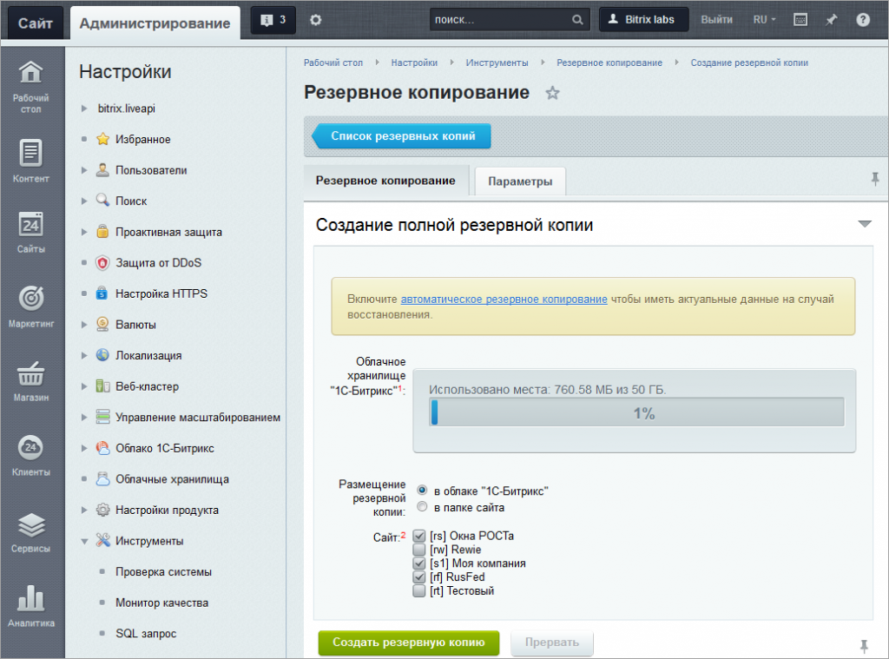
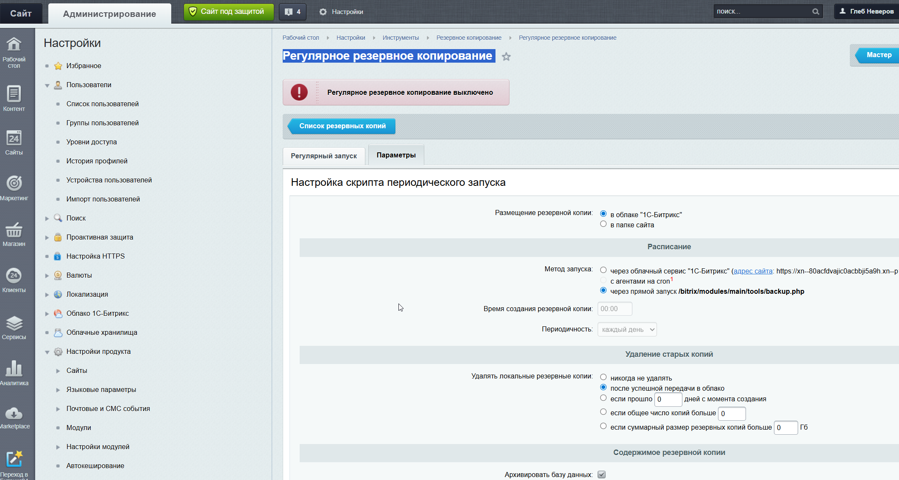
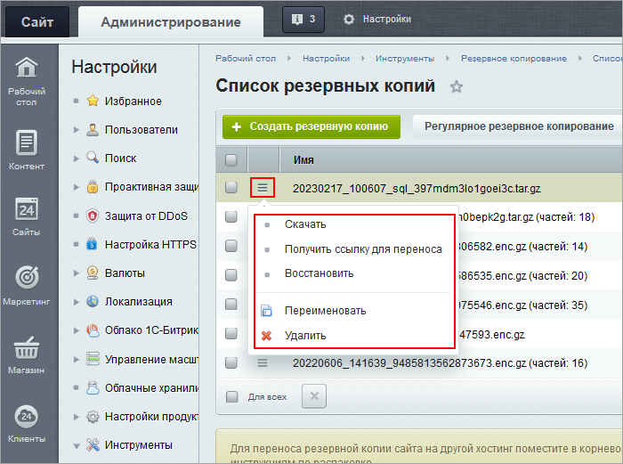

# Резервное копирование (бекап сайта)

[← Назад к общей документации](index.md)

**Бекап** — это копия сайта на случай, если что-то сломается. Из неё можно восстановить сайт в том виде, в каком он был на момент копии.

> 💡 Делайте бекап **перед любыми важными изменениями** на сайте (массовое редактирование товаров, обновления, эксперименты с настройками). Если что-то пойдёт не так — всегда можно вернуть как было.

## Как сделать бекап

Путь в админке: `Настройки → Инструменты → Резервное копирование → Создание резервной копии`

1. Выберите, **куда сохранить** копию:
   - **В облако 1С-Битрикс** — проще всего, ничего настраивать не нужно (бесплатно хранятся 3 последние копии; когда появляется новая, самая старая удаляется автоматически).
   - **На сервер** — копия сохранится в файлах сайта, её можно будет скачать к себе на компьютер.
2. Нажмите кнопку **«Создать резервную копию»**.
3. Дождитесь окончания — система сама сделает архив. Это может занять несколько минут.

Остальные настройки можно не трогать — подойдут значения по умолчанию.

## Автоматический бекап по расписанию

Чтобы не делать копии вручную каждый раз, можно настроить **автоматическое копирование по графику** — например, каждую ночь. Тогда система будет создавать бекапы сама.

Путь в админке: `Настройки → Инструменты → Резервное копирование → Регулярное резервное копирование`  
Прямая ссылка: [podomarket.ru/bitrix/admin/dump_auto.php](https://podomarket.ru/bitrix/admin/dump_auto.php?lang=ru)

Достаточно настроить один раз. Удобно, чтобы свежая копия сайта была всегда.

## Что делать с готовой копией

Все созданные копии видны в списке. Наведите на нужную копию, чтобы открыть меню действий:

- **Скачать** — сохранить архив к себе на компьютер.
- **Восстановить** — вернуть сайт к состоянию из этой копии.
- **Удалить** — убрать ненужную копию.

> ⚠️ **Восстановление заменяет всё содержимое сайта** данными из копии. Перед восстановлением убедитесь, что выбрали нужный архив.

## Официальная документация

Подробно про резервное копирование, тонкие настройки и восстановление — в учебном курсе 1С-Битрикс:  
[dev.1c-bitrix.ru/learning/course/index.php?COURSE_ID=35&LESSON_ID=5330](https://dev.1c-bitrix.ru/learning/course/index.php?COURSE_ID=35&LESSON_ID=5330)

---

[← Назад к общей документации](index.md)
