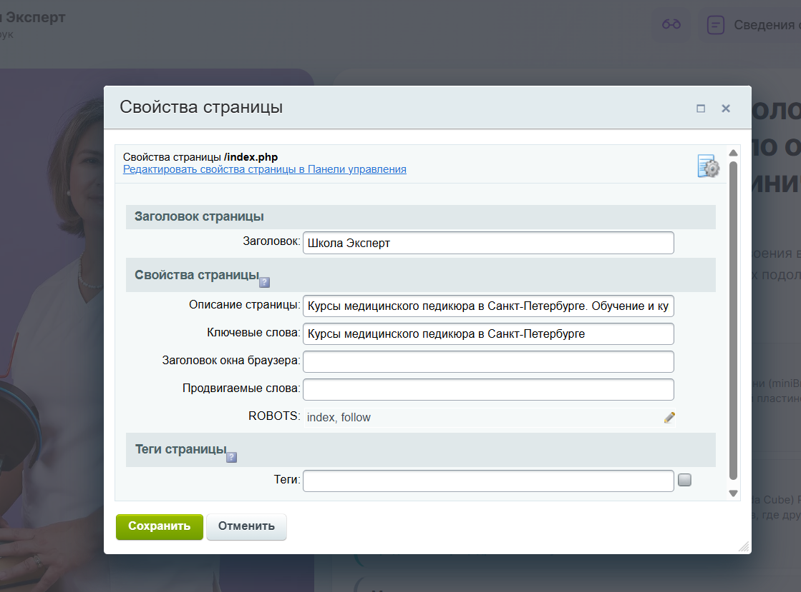
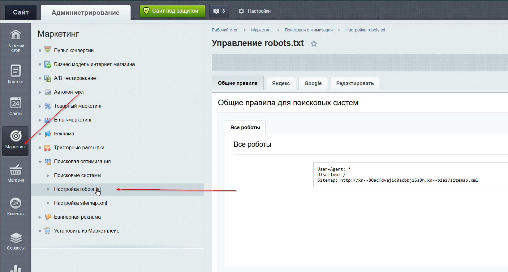
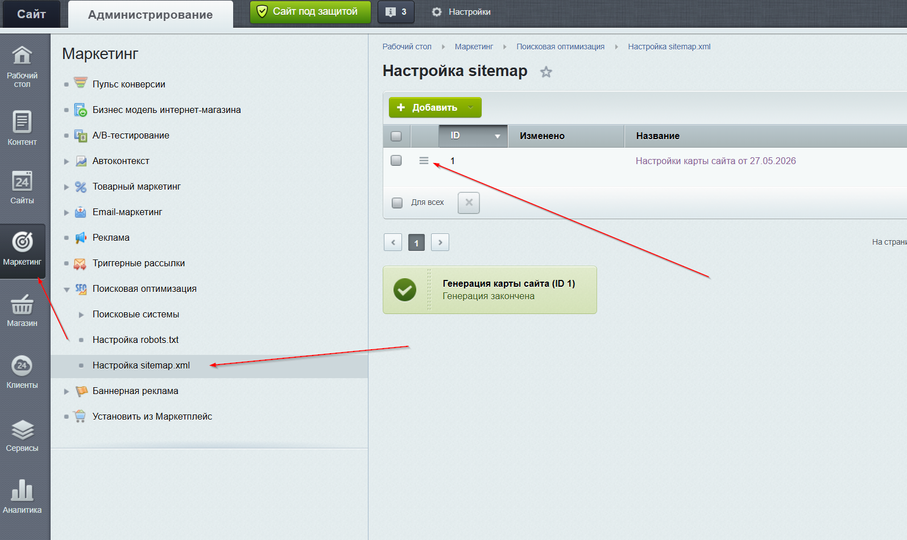

# SEO — базовая настройка сайта

Этот раздел описывает, что входит в базовую SEO-оптимизацию сайта, которую мы выполняем в рамках разработки. Это техническая основа для продвижения — без неё любая дальнейшая SEO-работа будет менее эффективна.

---

## Что входит в базовое SEO

### 1. Мета-теги страниц

Для каждой страницы задаются:

- **`<title>`** — заголовок страницы, отображается во вкладке браузера и в результатах поиска
- **`<meta name="description">`** — краткое описание страницы (сниппет в поисковой выдаче)

> **Важно:** содержимое этих тегов готовит клиент или копирайтер. Мы обеспечиваем техническую возможность задать их для каждой страницы.

#### Как изменить Title и Description в 1С-Битрикс

Для каждой страницы поля задаются в административной панели в свойствах страницы или элемента инфоблока:




---

### 2. Семантическая разметка контента

- Корректная иерархия заголовков: **H1** — один на странице, **H2–H6** — вложенная структура
- Атрибут **`alt`** у всех изображений (описание картинки для поисковиков и accessibility)

---

### 4. Канонические URL

Тег `<link rel="canonical">` указывает поисковику основной адрес страницы. Исключает проблемы с дублированием контента (например, страницы с параметрами `?utm_source=...`).

---

### 5. Robots.txt

Файл `/robots.txt` — инструкция для поисковых роботов:

- Какие страницы индексировать
- Какие страницы закрыть от индексации (личный кабинет, корзина, страницы-черновики)

#### Настройка Robots.txt в 1С-Битрикс

📖 [Официальная документация Битрикс — Robots.txt](https://dev.1c-bitrix.ru/learning/course/index.php?COURSE_ID=139&LESSON_ID=5814&LESSON_PATH=11427.4545.5814)

**Где настраивается:**

`Административная панель → Маркетинг → Поисковая оптимизация → Настройка robots.txt`



---

### 6. Sitemap.xml

Файл `/sitemap.xml` — карта сайта для поисковиков. Содержит список всех публичных страниц с датами последнего изменения. Ускоряет индексацию новых страниц.

#### Настройка карты сайта в 1С-Битрикс

📖 [Официальная документация Битрикс — Карта сайта](https://dev.1c-bitrix.ru/learning/course/index.php?COURSE_ID=139&LESSON_ID=5816)

В Битриксе карта сайта генерируется автоматически и состоит из нескольких файлов. Главный файл `/sitemap.xml` — это **индексная карта**, которая не содержит страниц напрямую, а только ссылки на дочерние карты:

```xml
<sitemapindex xmlns="http://www.sitemaps.org/schemas/sitemap/0.9">
  <sitemap>
    <loc>https://example.ru/sitemap-files.xml</loc>
    <lastmod>2026-05-27T08:38:56+03:00</lastmod>
  </sitemap>
  <sitemap>
    <loc>https://example.ru/sitemap-iblock-1.xml</loc>
    <lastmod>2026-05-27T08:38:57+03:00</lastmod>
  </sitemap>
  ...
</sitemapindex>
```

**Что означают дочерние карты:**

| Файл | Что содержит |
|---|---|
| `sitemap-files.xml` | Статические страницы сайта (разделы, созданные вручную) |
| `sitemap-iblock-N.xml` | Страницы инфоблока с ID = N (новости, услуги, каталог и т.д.) |

> Номер в названии файла (`iblock-1`, `iblock-3`, `iblock-24`) соответствует ID инфоблока в административной панели Битрикс.

**Где настраивается:**

`Административная панель → Маркетинг → Поисковая оптимизация → Настройка sitemap.xml`



Там можно:
- включить/выключить генерацию карты
- выбрать, какие инфоблоки включать
- настроить частоту обновления (`changefreq`) и приоритет страниц (`priority`)

---

### 7. Структурированные данные (Schema.org)

Микроразметка помогает поисковику «понять» содержимое страницы и показывать расширенные сниппеты в выдаче. Базово подключаем:

- **Organization** — название, адрес, контакты, логотип компании
- **BreadcrumbList** — хлебные крошки (навигационная цепочка)
- **Course** — карточки курсов

Подробнее со схемами и примерами кода: [Микроразметка Schema.org](schema.md)

---

### 8. Базовая техническая оптимизация

- HTTPS — сайт работает по защищённому протоколу
- Корректные редиректы (301) при смене адресов страниц
- Отсутствие битых ссылок (404)
- Мобильная адаптация — сайт корректно отображается на смартфонах

---

## Что НЕ входит в базовое SEO

Следующее **выходит за рамки** технической настройки сайта и требует отдельной работы — самостоятельно или с SEO-специалистом:

| Задача | Почему не входит |
|---|---|
| Написание SEO-текстов и описаний | Это контентная работа, требует копирайтера и семантического ядра |
| Сбор семантического ядра (ключевые слова) | Маркетинговая задача, зависит от ниши и региона |
| Наращивание ссылочной массы | Внешнее продвижение, не связано с кодом сайта |
| Настройка Яндекс.Метрики / Google Analytics | Это веб-аналитика, отдельная задача |
| Продвижение в Яндекс Картах / Google Maps | Это локальное SEO, работа с профилями компании |
| Регулярный SEO-аудит и мониторинг позиций | Ongoing-работа SEO-специалиста |
| Настройка Яндекс.Вебмастера / Google Search Console | Выполняется при подключении аналитики |

---

## Как посмотреть HTML код страницы
- Просмотр исходного кода страницы (`Ctrl+U`) — наличие мета-тегов

---

> **Итог:** базовое SEO — это техническая подготовка сайта. Оно создаёт правильный фундамент, но само по себе не гарантирует высоких позиций. Для роста в поиске необходима дополнительная работа с контентом и ссылочным профилем.
