# Настройка блоков главной страницы

Блоки управляются через инфоблоки в административной панели:

`Рабочий стол → Контент → Контент Landing`

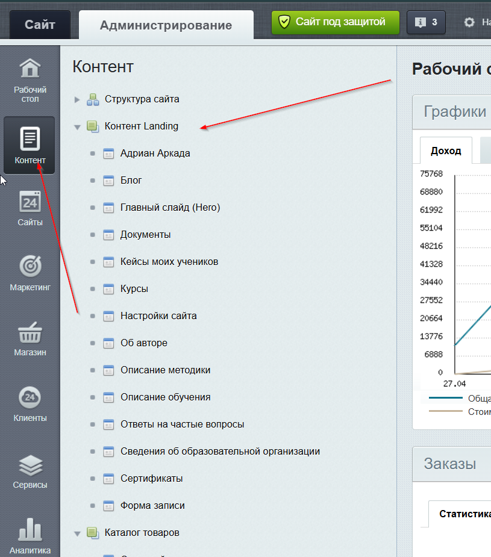

---

## Список блоков

| Блок | ID | Описание |
|---|---|---|
| [Главный слайд (Hero)](https://xn--80acfdvajic0acbbji5a9h.xn--p1ai/bitrix/admin/iblock_element_admin.php?IBLOCK_ID=7&type=news&lang=ru&apply_filter=Y) | 7 | Заглавный экран лендинга. H1 страницы |
| [Курсы](https://xn--80acfdvajic0acbbji5a9h.xn--p1ai/bitrix/admin/iblock_element_admin.php?IBLOCK_ID=6&type=news&lang=ru&apply_filter=Y) | 6 | Список курсов с ценами |
| [Описание методики](https://xn--80acfdvajic0acbbji5a9h.xn--p1ai/bitrix/admin/iblock_element_admin.php?IBLOCK_ID=9&type=news&lang=ru&apply_filter=Y) | 9 | Блок с описанием методик |
| [Описание обучения](https://xn--80acfdvajic0acbbji5a9h.xn--p1ai/bitrix/admin/iblock_element_admin.php?IBLOCK_ID=10&type=news&lang=ru&apply_filter=Y) | 10 | Блок о процессе обучения |
| [Об авторе](https://xn--80acfdvajic0acbbji5a9h.xn--p1ai/bitrix/admin/iblock_element_admin.php?IBLOCK_ID=8&type=news&lang=ru&apply_filter=Y) | 8 | Информация о преподавателе |
| [Адриан Аркада](https://xn--80acfdvajic0acbbji5a9h.xn--p1ai/bitrix/admin/iblock_element_admin.php?IBLOCK_ID=27&type=news&lang=ru&apply_filter=Y) | 27 | Блок про метод Adrián Arcada |
| [Кейсы моих учеников](https://xn--80acfdvajic0acbbji5a9h.xn--p1ai/bitrix/admin/iblock_element_admin.php?IBLOCK_ID=5&type=news&lang=ru&apply_filter=Y) | 5 | Портфолио / результаты учеников |
| [Сертификаты](https://xn--80acfdvajic0acbbji5a9h.xn--p1ai/bitrix/admin/iblock_element_admin.php?IBLOCK_ID=23&type=news&lang=ru&apply_filter=Y) | 23 | Сертификаты преподавателя и школы |
| [Блог](https://xn--80acfdvajic0acbbji5a9h.xn--p1ai/bitrix/admin/iblock_element_admin.php?IBLOCK_ID=24&type=news&lang=ru&apply_filter=Y) | 24 | Последние статьи из блога |
| [Ответы на частые вопросы](https://xn--80acfdvajic0acbbji5a9h.xn--p1ai/bitrix/admin/iblock_element_admin.php?IBLOCK_ID=4&type=news&lang=ru&apply_filter=Y) | 4 | FAQ |
| [Форма записи](https://xn--80acfdvajic0acbbji5a9h.xn--p1ai/bitrix/admin/iblock_element_admin.php?IBLOCK_ID=26&type=news&lang=ru&apply_filter=Y) | 26 | Форма обратной связи / записи на курс |
| [Документы](https://xn--80acfdvajic0acbbji5a9h.xn--p1ai/bitrix/admin/iblock_element_admin.php?IBLOCK_ID=3&type=news&lang=ru&apply_filter=Y) | 3 | Юридические документы |
| [Сведения об образовательной организации](https://xn--80acfdvajic0acbbji5a9h.xn--p1ai/bitrix/admin/iblock_element_admin.php?IBLOCK_ID=1&type=news&lang=ru&apply_filter=Y) | 1 | Обязательный раздел по требованиям Рособрнадзора |
| [Настройки сайта](https://xn--80acfdvajic0acbbji5a9h.xn--p1ai/bitrix/admin/iblock_element_admin.php?IBLOCK_ID=25&type=news&lang=ru&apply_filter=Y) | 25 | Общие настройки: контакты, реквизиты и т.д. |

---

## Главный слайд (Hero)

[Открыть в админке](https://xn--80acfdvajic0acbbji5a9h.xn--p1ai/bitrix/admin/iblock_element_admin.php?IBLOCK_ID=7&type=news&lang=ru&apply_filter=Y)

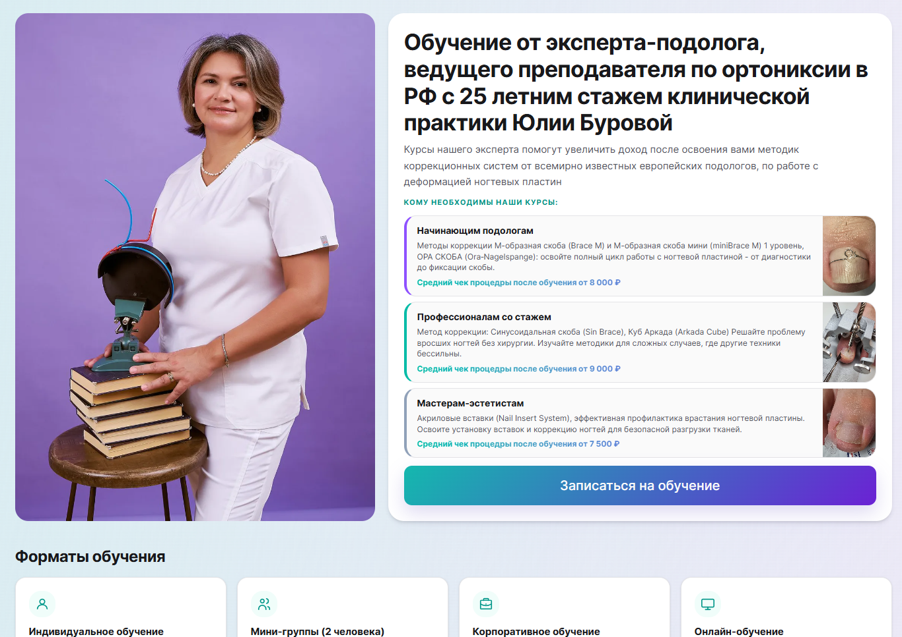

---

## Об авторе

[Открыть в админке](https://xn--80acfdvajic0acbbji5a9h.xn--p1ai/bitrix/admin/iblock_element_admin.php?IBLOCK_ID=8&type=news&lang=ru&apply_filter=Y)

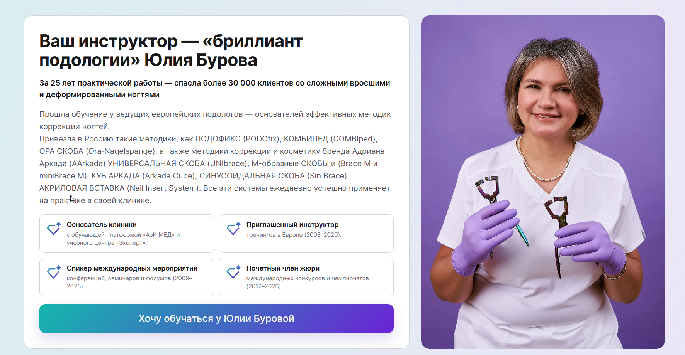

---

## Описание методики

[Открыть в админке](https://xn--80acfdvajic0acbbji5a9h.xn--p1ai/bitrix/admin/iblock_element_admin.php?IBLOCK_ID=9&type=news&lang=ru&apply_filter=Y)

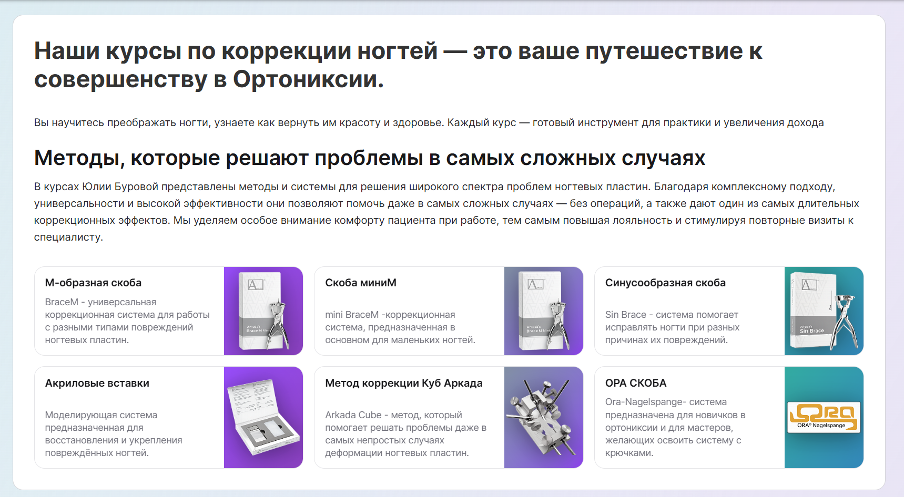

---

## Курсы

[Открыть в админке](https://xn--80acfdvajic0acbbji5a9h.xn--p1ai/bitrix/admin/iblock_element_admin.php?IBLOCK_ID=6&type=news&lang=ru&apply_filter=Y)

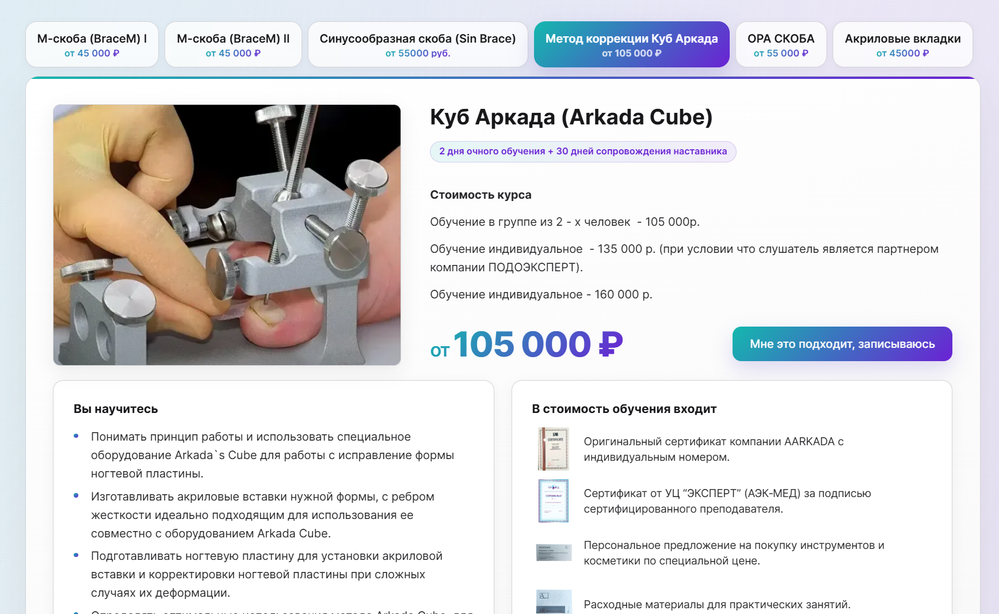

---

## Адриан Аркада

[Открыть в админке](https://xn--80acfdvajic0acbbji5a9h.xn--p1ai/bitrix/admin/iblock_element_admin.php?IBLOCK_ID=27&type=news&lang=ru&apply_filter=Y)

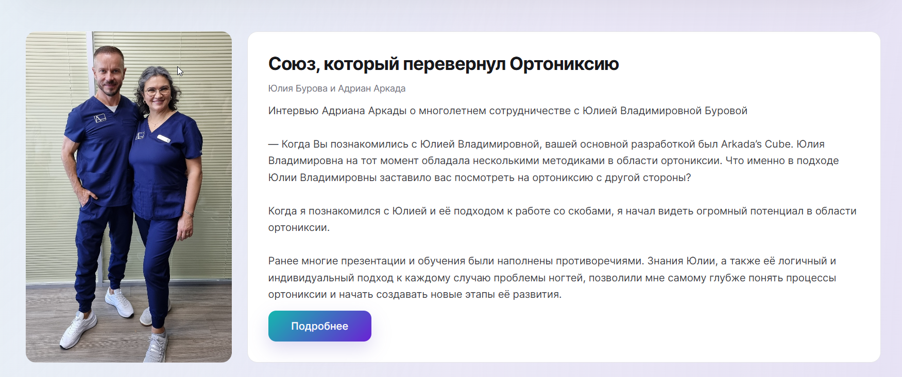

---

## Сертификаты

[Открыть в админке](https://xn--80acfdvajic0acbbji5a9h.xn--p1ai/bitrix/admin/iblock_element_admin.php?IBLOCK_ID=23&type=news&lang=ru&apply_filter=Y)

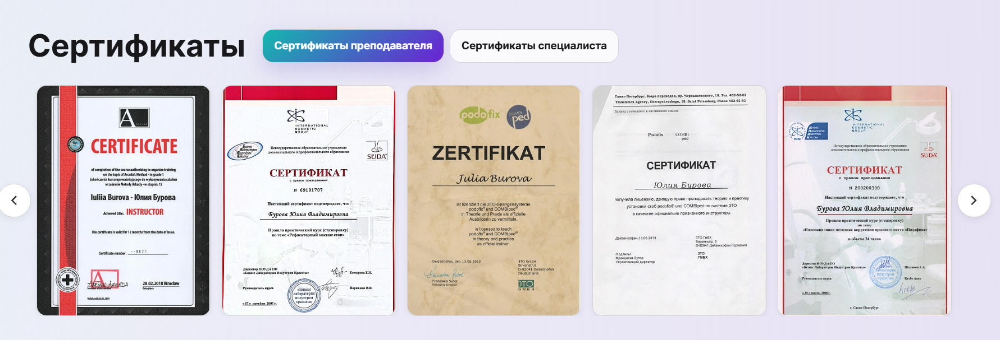

---

## Кейсы моих учеников

[Открыть в админке](https://xn--80acfdvajic0acbbji5a9h.xn--p1ai/bitrix/admin/iblock_element_admin.php?IBLOCK_ID=5&type=news&lang=ru&apply_filter=Y)

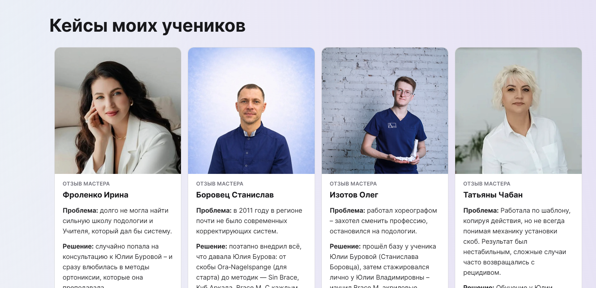

---

## Описание обучения

[Открыть в админке](https://xn--80acfdvajic0acbbji5a9h.xn--p1ai/bitrix/admin/iblock_element_admin.php?IBLOCK_ID=10&type=news&lang=ru&apply_filter=Y)

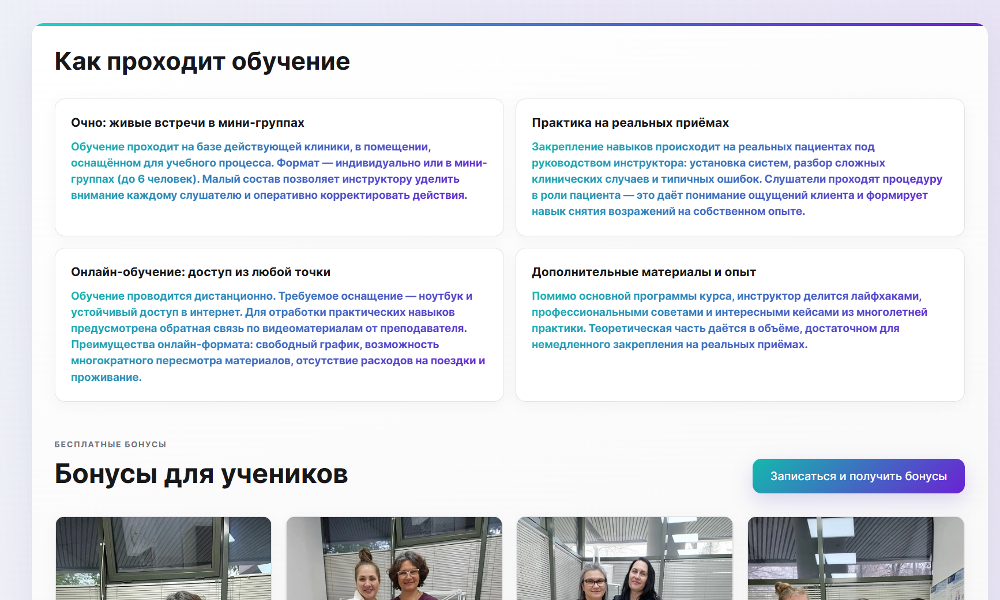

---

## Ответы на частые вопросы

[Открыть в админке](https://xn--80acfdvajic0acbbji5a9h.xn--p1ai/bitrix/admin/iblock_element_admin.php?IBLOCK_ID=4&type=news&lang=ru&apply_filter=Y)

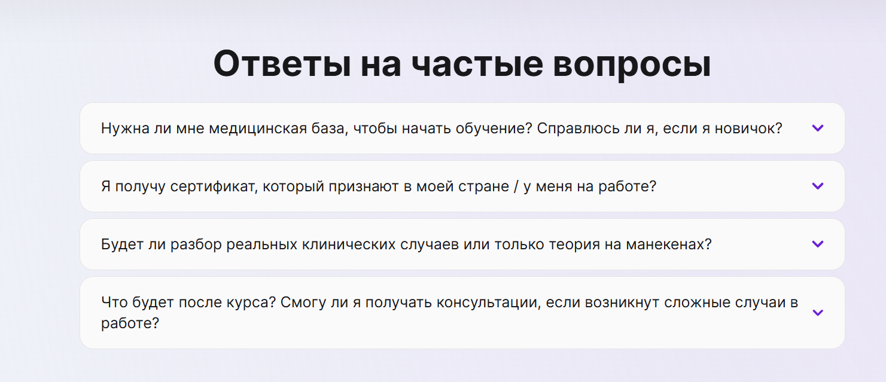

---

## Блог

[Открыть в админке](https://xn--80acfdvajic0acbbji5a9h.xn--p1ai/bitrix/admin/iblock_element_admin.php?IBLOCK_ID=24&type=news&lang=ru&apply_filter=Y)

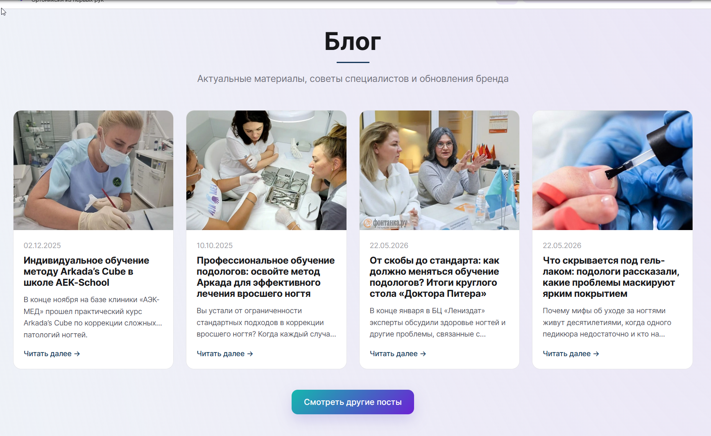

> **Важно:** часть настроек блока находится в разделе [Настройки сайта](settings.md) (заголовок, подзаголовок и текст кнопки секции).

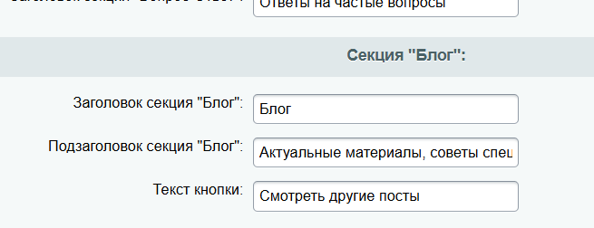

---

## Форма записи

[Открыть в админке](https://xn--80acfdvajic0acbbji5a9h.xn--p1ai/bitrix/admin/iblock_element_admin.php?IBLOCK_ID=26&type=news&lang=ru&apply_filter=Y)

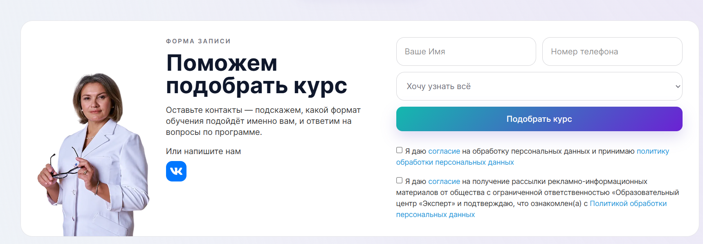

