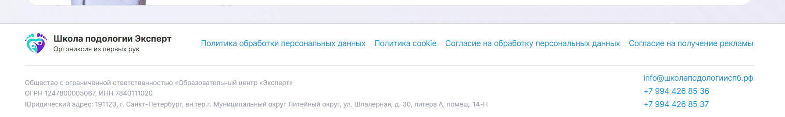
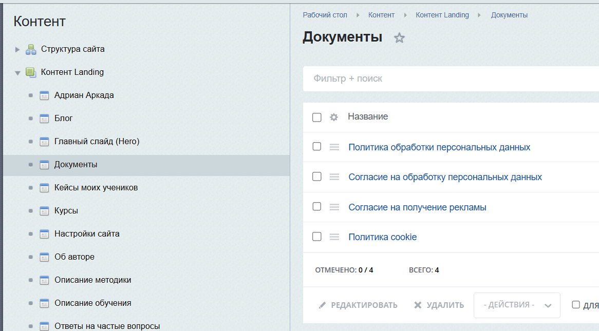
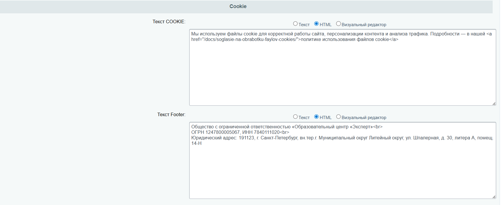
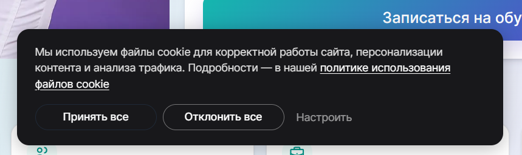

# Настройка Подвала (Footer) сайта

Настраивается в разделе [Общие настройки сайта](settings.md)

---

### Ссылки на политики

В футере отображаются ссылки на документы. Названия ссылок соответствуют заголовку элемента в инфоблоке.

Редактировать: [Документы в админке](https://xn--80acfdvajic0acbbji5a9h.xn--p1ai/bitrix/admin/iblock_element_admin.php?IBLOCK_ID=3&type=news&lang=ru&apply_filter=Y)

| Документ | URL |
|---|---|
| Политика обработки персональных данных | [/docs/politika-konfidentsialnosti/](https://xn--80acfdvajic0acbbji5a9h.xn--p1ai/docs/politika-konfidentsialnosti/) |
| Согласие на обработку персональных данных | [/docs/soglasie-na-obrabotku-pdn/](https://xn--80acfdvajic0acbbji5a9h.xn--p1ai/docs/soglasie-na-obrabotku-pdn/) |
| Согласие на получение рекламы | [/docs/soglasiye-na-reklamy/](https://xn--80acfdvajic0acbbji5a9h.xn--p1ai/docs/soglasiye-na-reklamy/) |
| Политика cookie | [/docs/soglasie-na-obrabotku-faylov-cookies/](https://xn--80acfdvajic0acbbji5a9h.xn--p1ai/docs/soglasie-na-obrabotku-faylov-cookies/) |

В этом же разделе редактируется текст уведомления о Cookie, которое показывается при первом посещении сайта:

