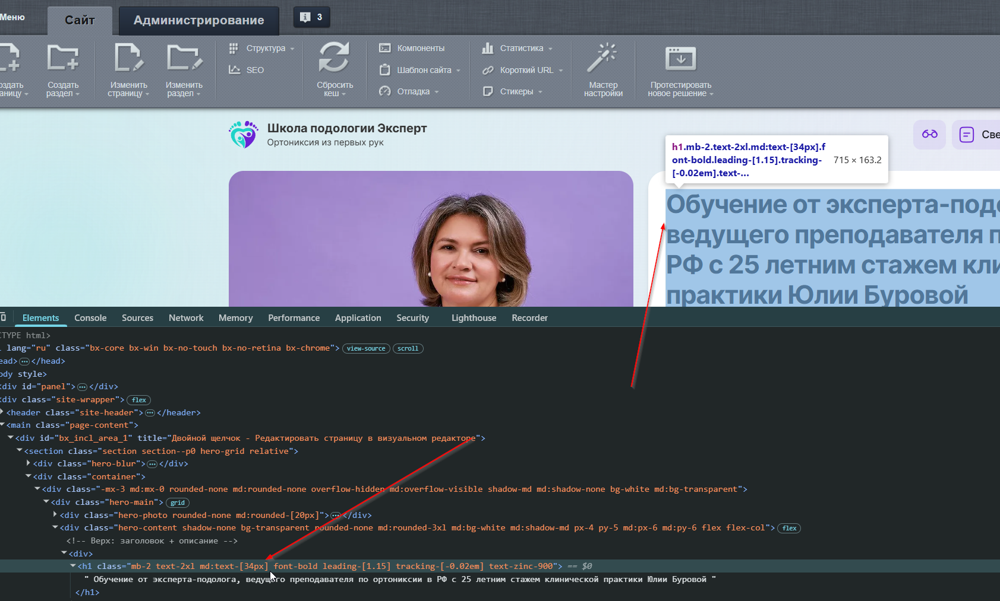
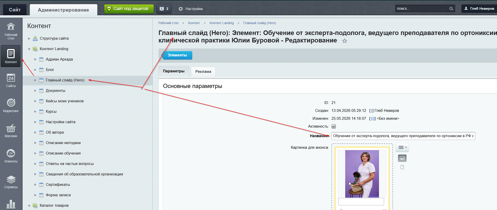

# Как изменить H1 на лендинге

H1 на лендинге задаётся через инфоблок, а не через свойства страницы.

**Путь:** `Рабочий стол → Контент → Контент Landing → Главный слайд (Hero)`

Поле **«Название»** — это и есть H1 страницы.

