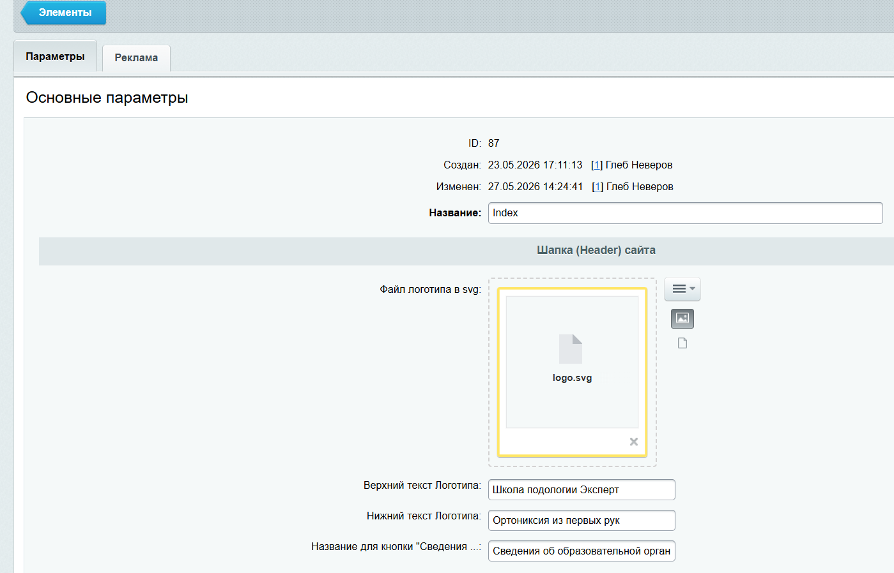

# Настройка Шапки (Header) сайта

Настраивается в разделе [Общие настройки сайта](settings.md)

**Параметры:**

| Поле | Описание |
|---|---|
| Файл логотипа в svg | Логотип в шапке (файл `logo.svg`) |
| Верхний текст Логотипа | Название школы рядом с логотипом |
| Нижний текст Логотипа | Подпись под названием («Ортониксия из первых рук») |
| Название для кнопки «Сведения...» | Текст кнопки ссылки на раздел сведений об организации |
