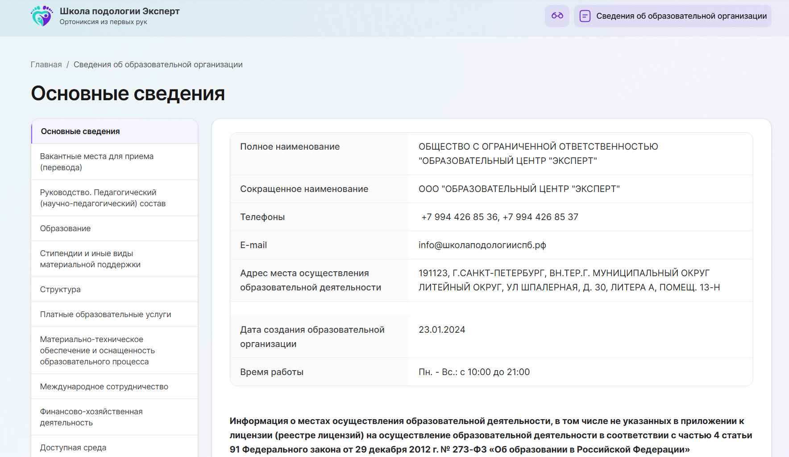

# Сведения об образовательной организации

Раздел сайта: [/info/](https://xn--80acfdvajic0acbbji5a9h.xn--p1ai/info/)

Обязательный раздел по требованиям Рособрнадзора.

[Открыть в админке](https://xn--80acfdvajic0acbbji5a9h.xn--p1ai/bitrix/admin/iblock_element_admin.php?IBLOCK_ID=1&type=news&lang=ru&apply_filter=Y)

У каждой страницы раздела могут быть свои **Title** и **Description**. Подробнее: [Настройка базового SEO в 1С-Битрикс](../../common/seo/index.md)
