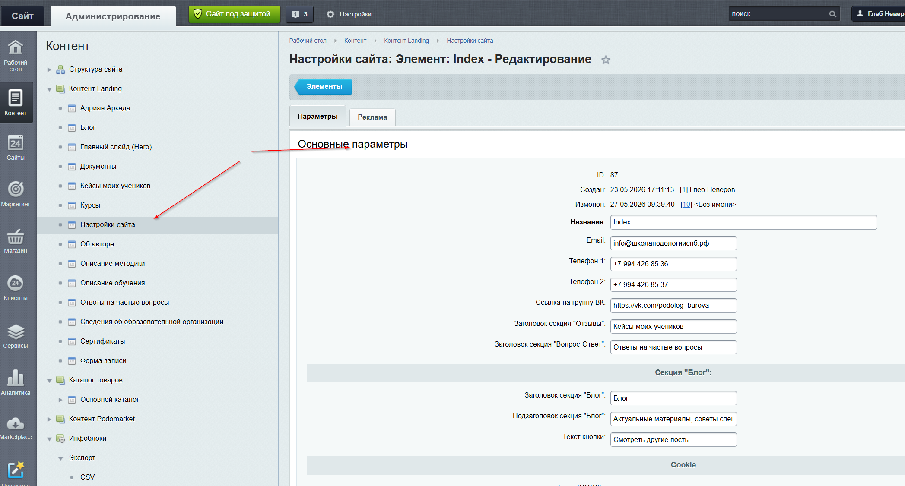
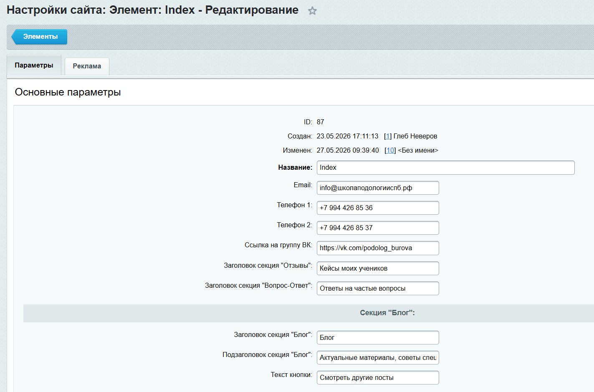

# Общие настройки сайта

[Открыть в админке](https://xn--80acfdvajic0acbbji5a9h.xn--p1ai/bitrix/admin/iblock_element_edit.php?IBLOCK_ID=25&type=news&lang=ru&ID=87&find_section_section=-1&WF=Y)

**Параметры:**

| Поле | Описание |
|---|---|
| Email | Почта, отображается в футере |
| Телефон 1 | Основной телефон |
| Телефон 2 | Дополнительный телефон |
| Ссылка на группу ВК | Ссылка на сообщество ВКонтакте |
| Заголовок секции «Отзывы» | Название блока с кейсами на главной |
| Заголовок секции «Вопрос-Ответ» | Название блока FAQ на главной |
| Заголовок секции «Блог» | Название блока Блог на главной |
| Подзаголовок секции «Блог» | Подзаголовок блока Блог |
| Текст кнопки | Текст кнопки в блоке Блог |
| Текст Footer | Юридическая информация в подвале (HTML) |
| Текст Cookie | Текст уведомления о Cookie (HTML) |
