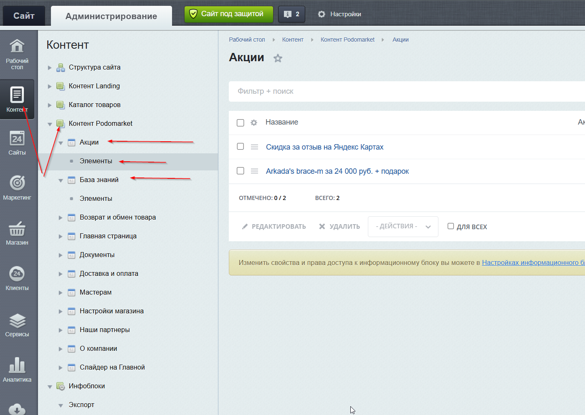

# Контент для сайта

[← Назад к содержанию](index.md)

Путь: **Контент → Контент Podomarket**

Здесь хранится контент страниц сайта — акции, база знаний, вопросы и ответы, партнёры и др. Каждый раздел содержит список элементов — нужно переходить в **Элементы** нужного раздела, чтобы добавить или отредактировать запись.

<!-- скриншот: подразделы контента -->

---

[← Назад к содержанию](index.md)
