# Руководство администратора — podoexpert.ru

Инструкция по управлению интернет-магазином на 1С-Битрикс.

Адрес админки: [podomarket.ru/bitrix/admin](https://podomarket.ru/bitrix/admin)

---

## Содержание

1. [Каталог товаров](#каталог-товаров)
   - [Создание категории](#создание-категории)
   - [Добавление товара](#добавление-товара)
   - [Добавление комплекта](#добавление-комплекта)
2. [Контент для сайта](#контент-для-сайта)
3. [Заказы](#заказы)
   - [Обработка заказа](#обработка-заказа)
4. [Настройки магазина](#настройки-магазина)
   - [Контактные данные](#контактные-данные)

---

## Каталог товаров

Путь в админке: **Магазин → Основной каталог → Разделы**

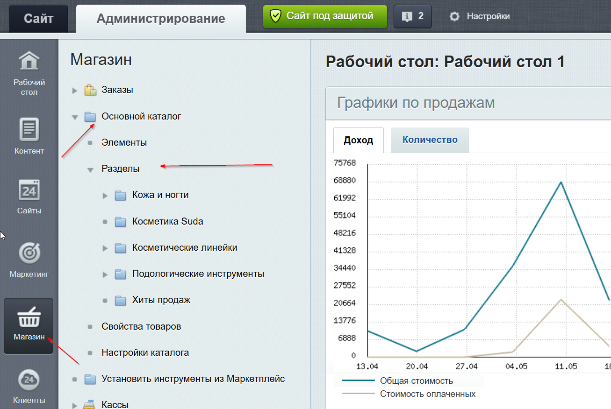

Каталог состоит из разделов (категорий) и товаров внутри них. Разделы видны в левом меню под «Основной каталог».

---

### Создание категории

Путь: **Магазин → Основной каталог → Разделы → Добавить раздел**

Обязательные поля:
- **Название** — отображается на сайте в меню и хлебных крошках
- **Символьный код** — часть URL категории, заполняется автоматически из названия
- **Активность** — включить, чтобы категория показывалась на сайте

Категорию можно вложить в другую — выбрать родительский раздел в поле **«Раздел»**.

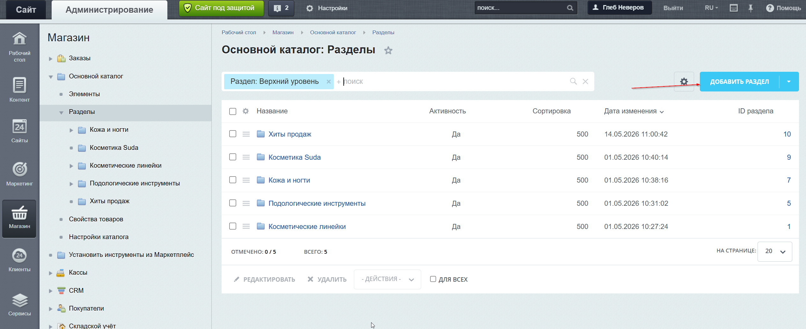

Поля **«Название для главной»** и **«Описание для главной»** заполнять только если категория выводится на главной странице сайта. Если категория на главной не используется — можно оставить пустыми.

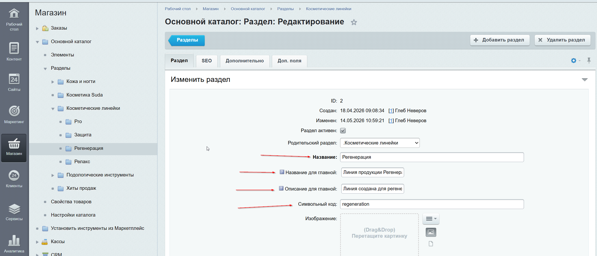

---

### Добавление товара

Путь в админке: **Магазин → Основной каталог → Элементы → Добавить → Товар**

Элементы — это плоский список всех товаров каталога без разбивки по разделам.

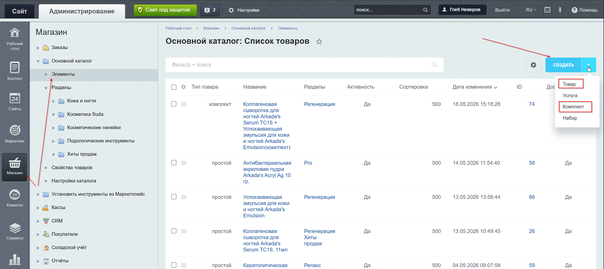

Обязательные поля при создании:
- **Раздел** — к какой категории относится товар
- **Название** — отображается на сайте и в заказах
- **Символьный код** — URL товара, заполняется автоматически из названия (можно изменить вручную)
- **Активность** — включить, чтобы товар показывался на сайте

#### Основные поля

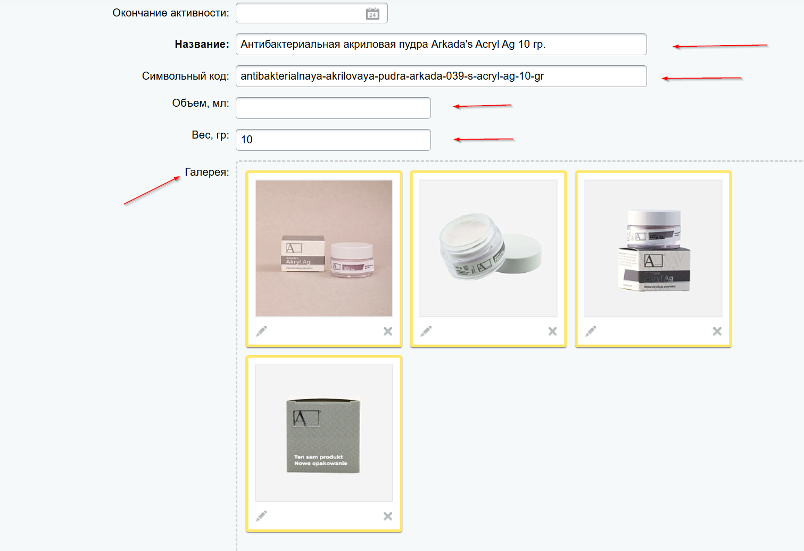

- **Название** — полное название товара
- **Символьный код** — генерируется автоматически, менять не нужно
- **Объём, мл** и **Вес, гр** — физические характеристики товара
- **Галерея** — фотографии товара, можно добавить несколько

#### Описания

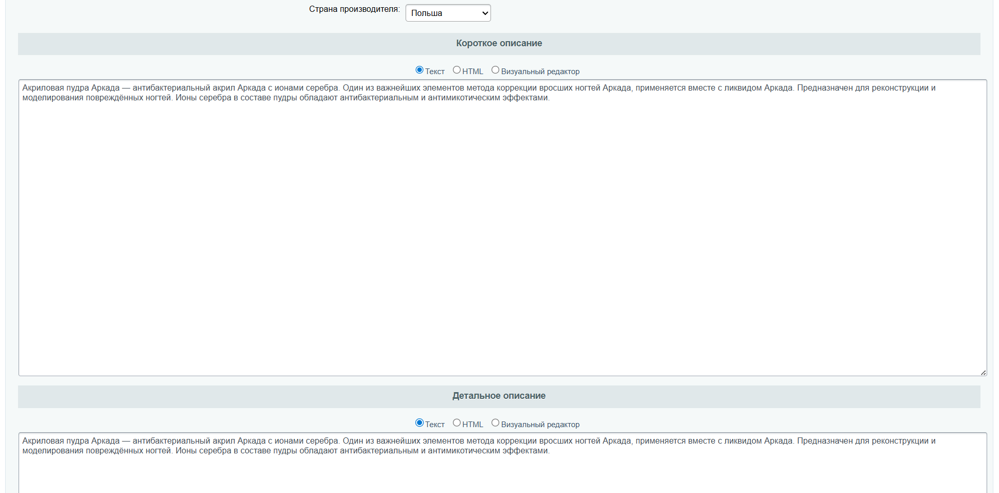

- **Страна производителя** — выбирается из списка
- **Короткое описание** — показывается в карточке товара в списке
- **Детальное описание** — полное описание на странице товара

Оба поля можно заполнять в режиме **Текст** (обычный) или **Визуальный редактор** (с форматированием).

#### Дополнительные свойства

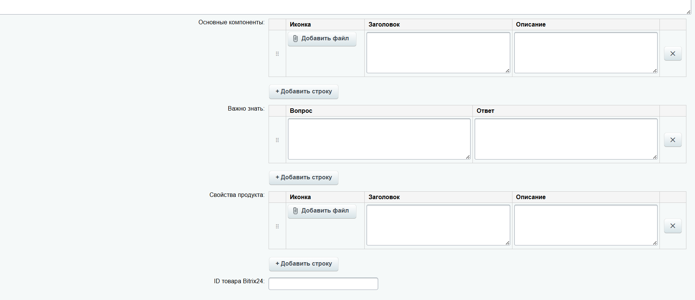

- **Основные компоненты** — список ингредиентов с иконкой, заголовком и описанием. Добавляются строками через «+ Добавить строку»
- **Важно знать** — блок вопрос/ответ на странице товара
- **Свойства продукта** — характеристики с иконкой и описанием
- **ID товара Bitrix24** — обязательное поле для интеграции с Bitrix24 CRM. ID берётся из каталога Bitrix24: [podoexpert.bitrix24.ru/crm/catalog/](https://podoexpert.bitrix24.ru/crm/catalog/) — открыть товар, в URL будет его ID. Пример: товар с ID `498` → [/crm/catalog/24/product/498/](https://podoexpert.bitrix24.ru/crm/catalog/24/product/498/)

#### Цены

Вкладка **«Торговый каталог»** в карточке товара → **«Цены»**.

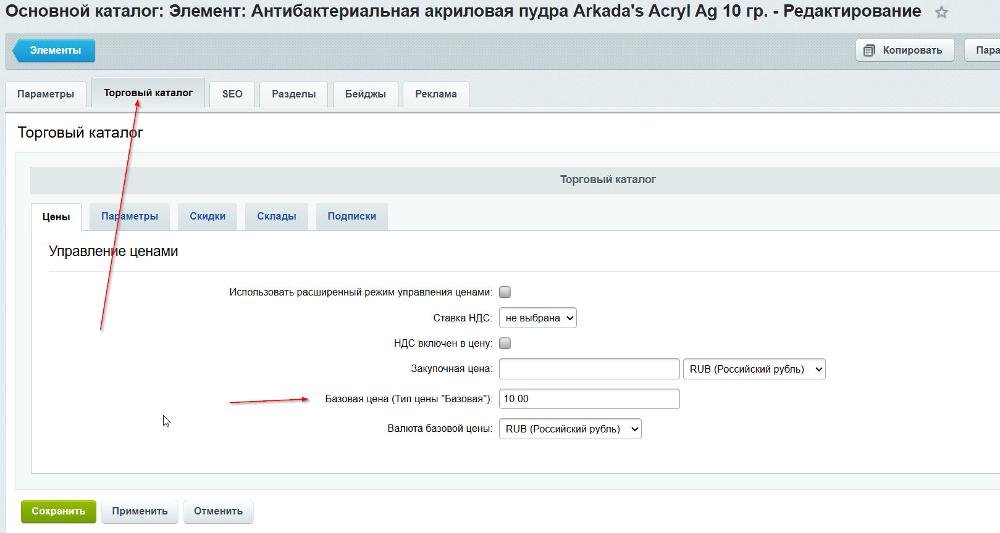

- **Базовая цена (Тип цены "Базовая")** — основная цена на сайте, обязательно к заполнению

#### Количество товара

Вкладка **«Торговый каталог»** → **«Параметры»**.

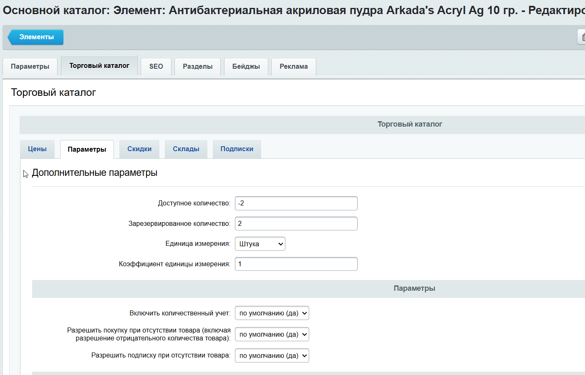

- **Доступное количество** — сколько единиц товара в наличии. Если значение `0` или отрицательное — товар не будет отображаться на сайте

#### Бейджи

Вкладка **«Бейджи»** в карточке товара — метки, которые отображаются на карточке товара на сайте.

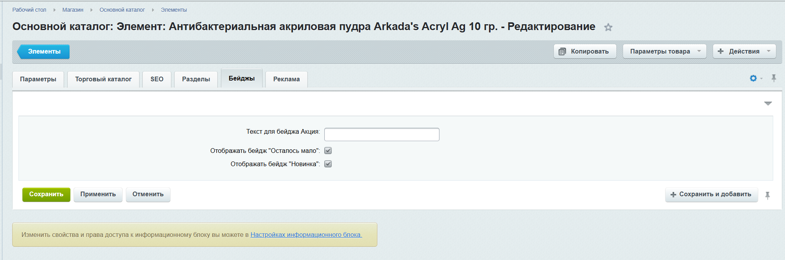

Всего 5 бейджей, на товаре может быть несколько одновременно:

| Бейдж | Как включается |
|---|---|
| Хит продаж | Автоматически, если товар добавлен в категорию «Хиты продаж» |
| Скидка | Автоматически, если на товар установлена скидка |
| Осталось мало | Вкладка «Бейджи» → включить чекбокс «Отображать бейдж "Осталось мало"» |
| Новинка | Вкладка «Бейджи» → включить чекбокс «Отображать бейдж Новинка» |
| Акция (произвольный текст) | Вкладка «Бейджи» → поле «Текст для бейджа Акция», например `5 + 1` |

#### Разделы

Вкладка **«Разделы»** в карточке товара — к каким категориям относится товар.

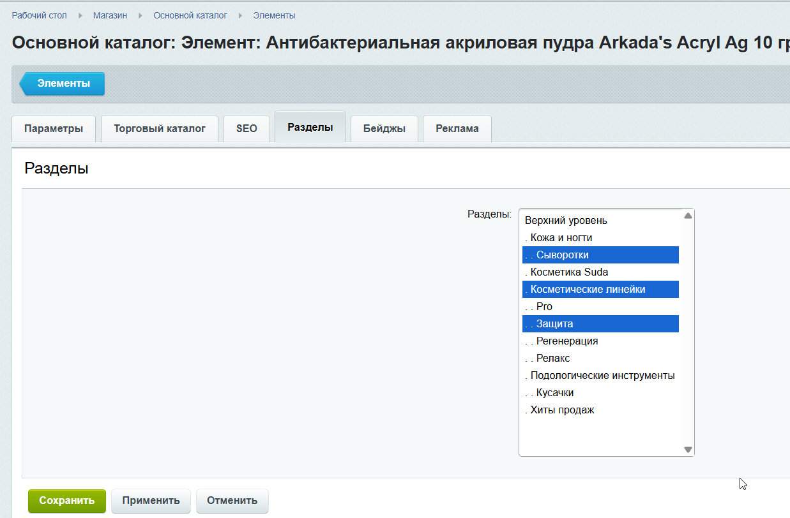

Чтобы выбрать несколько категорий — зажать **Ctrl** и кликать нужные разделы.

#### SEO

Вкладка **«SEO»** в карточке товара.

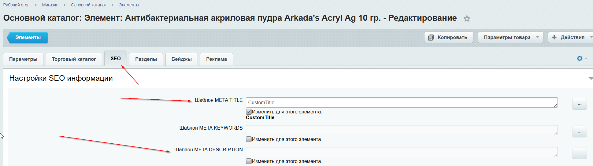

- **Шаблон META TITLE** — заголовок страницы товара в браузере и поисковиках
- **Шаблон META DESCRIPTION** — описание страницы для поисковиков

#### Скидки

Как добавить скидку на товар — видеоинструкция:  
[youtube.com/watch?v=okVzLZX5CAk](https://www.youtube.com/watch?v=okVzLZX5CAk)

---

### Добавление комплекта

Путь: **Магазин → Основной каталог → Элементы → Добавить → Комплект**

Все вкладки и поля заполняются так же, как у обычного товара. Единственное отличие — дополнительная вкладка **«Состав комплекта»**.

#### Состав комплекта

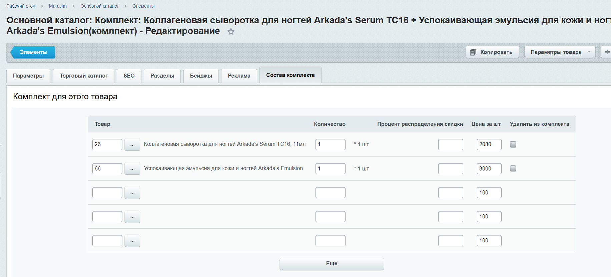

Для каждой позиции в составе:
- **Товар** — выбрать через кнопку «...»
- **Количество** — сколько единиц входит в комплект
- **Цена за шт.** — цена позиции в составе комплекта, используется для интеграции с Bitrix24

---

## Контент для сайта

Путь: **Контент → Контент Podomarket**

Здесь хранится контент страниц сайта — акции, база знаний, вопросы и ответы, партнёры и др. Каждый раздел содержит список элементов — нужно переходить в **Элементы** нужного раздела, чтобы добавить или отредактировать запись.

<!-- скриншот: подразделы контента -->

---

## Заказы

Путь: **Магазин → Заказы**  
Прямая ссылка: [podomarket.ru/bitrix/admin/sale_order.php](https://podomarket.ru/bitrix/admin/sale_order.php?lang=ru)

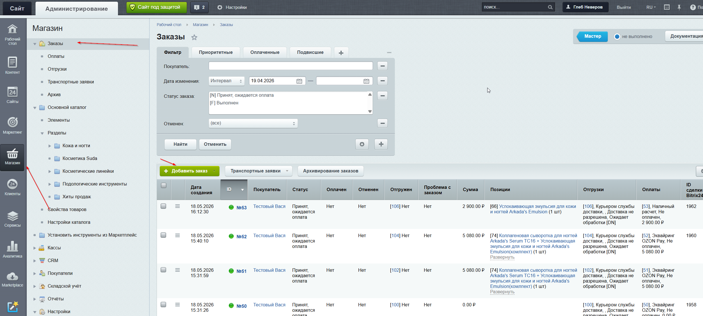

После создания заказа покупателем автоматически создаётся лид в Bitrix24.

Официальная документация по заказам: [dev.1c-bitrix.ru/user_help/store/sale/orders/sale_order.php](https://dev.1c-bitrix.ru/user_help/store/sale/orders/sale_order.php)

### Обработка заказа

1. Открыть заказ — нажать на его номер
2. Проверить состав и контакты покупателя
3. Изменить статус если необходимо, через выпадающий список **«Статус»**
4. Сохранить

При смене статуса покупателю автоматически уходит уведомление на email.
---

## Настройки магазина

### Контактные данные

Прямая ссылка: [podomarket.ru/bitrix/admin/iblock_element_edit.php?IBLOCK_ID=13&type=news_store&lang=ru&ID=40&find_section_section=-1&WF=Y](https://podomarket.ru/bitrix/admin/iblock_element_edit.php?IBLOCK_ID=13&type=news_store&lang=ru&ID=40&find_section_section=-1&WF=Y)

Здесь редактируются контактные данные магазина: email, мессенджеры, адрес, телефон, часы работы, ссылка на Яндекс Карты.

---

*Документ обновляется по мере изменений в магазине.*

---

## Дополнительно

Если что-то не нашли или непонятно — официальная пользовательская документация 1С-Битрикс:  
[dev.1c-bitrix.ru/user_help/service/index.php](https://dev.1c-bitrix.ru/user_help/service/index.php)
